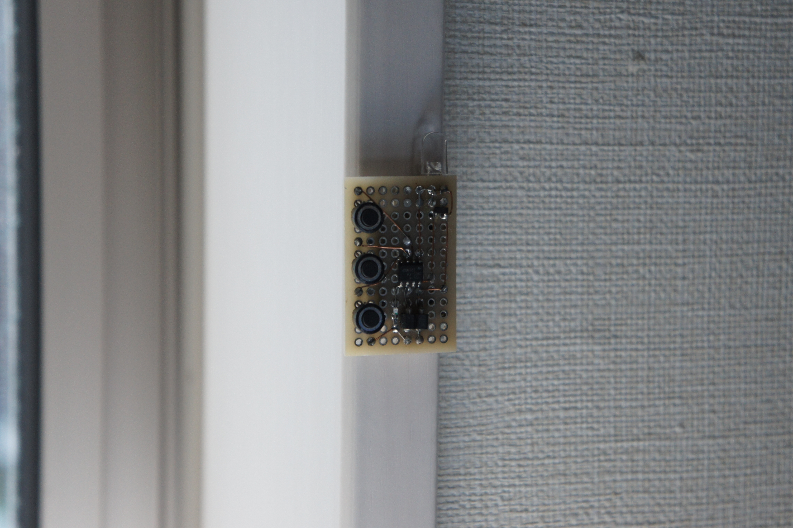
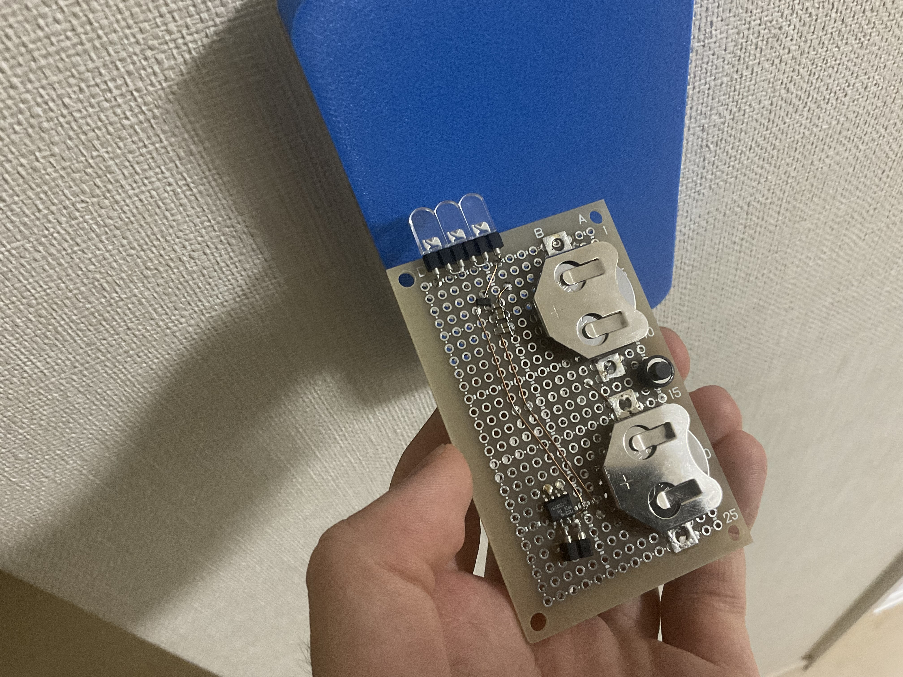
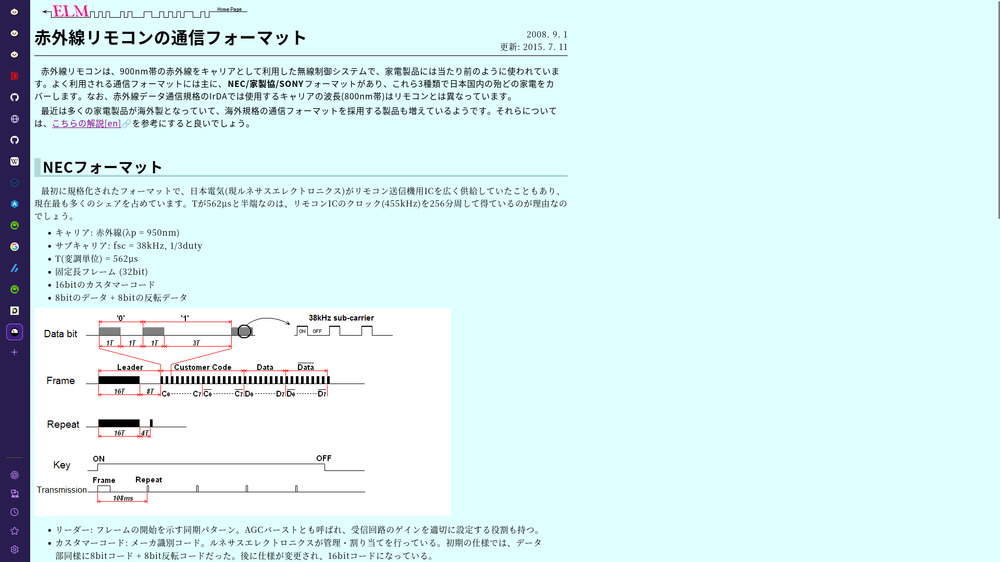
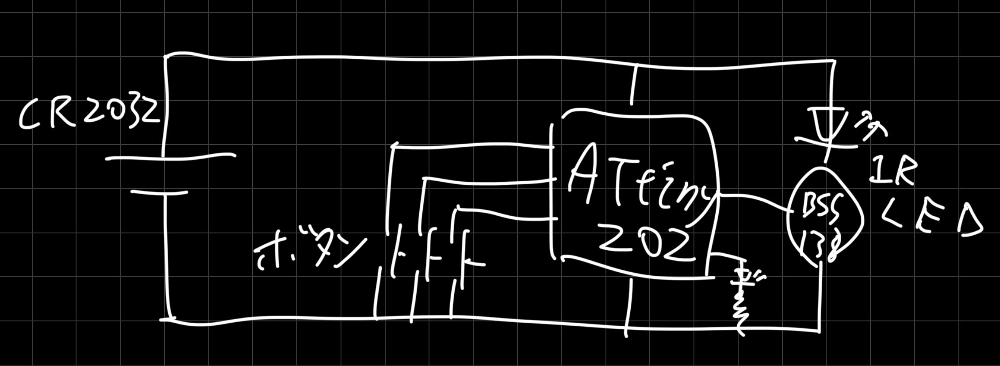

# modernAVRで赤外線リモコン
 @McbeEringi

---
壁スイッチ乗っ取り版


---
elm-chanさん いつもありがとう


---

回路図


---
リモコンのデータ

```c
// NEC Hotalux RE0212 (HLDC08301SG 付属)
const uint8_t nec_re_full[]={0x82,0x6d,0xa6,0x59};
const uint8_t nec_re_on[]={0x82,0x6d,0xa2,0x5d};
const uint8_t nec_re_dim[]={0x82,0x6d,0xbc,0x43};
const uint8_t nec_re_lumi[]={0x82,0x6d,0x71,0x22};
const uint8_t nec_re_off[]={0x82,0x6d,0xbe,0x41};
const uint8_t nec_re_cycle[]={0x82,0x6d,0xbf,0x40};

// AEHA Panasonic HK9327K
// https://hello-world.blog.ss-blog.jp/2011-05-07
const uint8_t pana_hk_up[]={0x2c,0x52,0x09,0x2a,0x23};// 明
const uint8_t pana_hk_dn[]={0x2c,0x52,0x09,0x2b,0x22};// 暗
const uint8_t pana_hk_full[]={0x2c,0x52,0x09,0x2c,0x25};// 全灯
const uint8_t pana_hk_on[]={0x2c,0x52,0x09,0x2d,0x24};// 点灯
const uint8_t pana_hk_dim[]={0x2c,0x52,0x09,0x2e,0x27};// 常夜灯
const uint8_t pana_hk_off[]={0x2c,0x52,0x09,0x2f,0x26};// 消灯
```
---

そーすこーど
```c
#define FOR(X) for(uint8_t i=0;i<X;++i)
#define FORBUF(X) for(uint8_t i=0,l=X;i<l;++i)
static void wait(){while(!(TCB0.INTFLAGS&TCB_CAPT_bm));TCB0.INTFLAGS=1;}// TCB0

static void sleep(){sei();SLPCTRL.CTRLA=SLPCTRL_SMODE_PDOWN_gc|SLPCTRL_SEN_bm;sleep_cpu();cli();}
ISR(PORTA_PORT_vect){PORTA.INTFLAGS=PORT_INT6_bm|PORT_INT7_bm|PORT_INT1_bm;}

void main(){
	_PROTECTED_WRITE(CLKCTRL.MCLKCTRLB,CLKCTRL_PDIV_64X_gc|CLKCTRL_PEN_bm);
	TCA0.SINGLE.CTRLA=TCA_SINGLE_ENABLE_bm;
	TCA0.SINGLE.CTRLB=IR_CMP_BM|TCA_SINGLE_WGMODE_SINGLESLOPE_gc;
	TCB0.CTRLA=TCB_ENABLE_bm;
	TCB0.CCMP=250;// init any 250==1ms

	IR_PORT.DIRSET=1<<IR_PIN;
	LED_PORT.DIRSET=1<<LED_PIN;

	PORTA.PIN6CTRL=PORT_PULLUPEN_bm|PORT_ISC_BOTHEDGES_gc;// BOTHEDGES|LEVEL
	PORTA.PIN7CTRL=PORT_PULLUPEN_bm|PORT_ISC_BOTHEDGES_gc;// BOTHEDGES|LEVEL
	PORTA.PIN1CTRL=PORT_PULLUPEN_bm|PORT_ISC_BOTHEDGES_gc;// BOTHEDGES|LEVEL

	while(1){
		sleep();FOR(20)wait();
		const uint8_t x=~VPORTA.IN;
		// ヒューズは書いたか?
		if(x&(1<<6))send_nec(nec_re_cycle);//send_aeha(pana_hk_on,40);
		else if(x&(1<<7))send_nec(nec_re_dim);//send_aeha(pana_hk_dim,40);
		else if(x&(1<<1))send_nec(nec_re_off);//send_aeha(pana_hk_off,40);
	}
}
```
---
各種プロトコルに対応
```c
static void send_common(const uint8_t ll,const uint8_t *x,const uint8_t l){
	IR_ON;FOR(ll)wait();IR_OFF;FOR(ll/2)wait();
	FOR(l){IR_ON;wait();IR_OFF;wait();if(x[i>>3]>>(i&7)&1)FOR(2)wait();}
	IR_ON;wait();IR_OFF;
}
static void send_nec(const uint8_t *x){set_38k_wait(562);send_common(16,x,32);}
static void send_aeha(const uint8_t *x,const uint8_t l){set_38k_wait(425);send_common(8,x,l);}
static const uint8_t send_sony(
	const uint8_t *x,const uint8_t l
){
	uint8_t t=75-4-l*2;
	set_40k_wait(600);
	IR_ON;FOR(4)wait();IR_OFF;
	FOR(l){wait();IR_ON;wait();if(x[i>>3]>>(i&7)&1){--t;wait();}IR_OFF;}
	return t;
}
```
---

クロックの変更まわり
```c
static uint8_t ir_on;
#define IR_ON TCA0.SINGLE.IR_CMPnBUF=ir_on
#define IR_OFF TCA0.SINGLE.IR_CMPnBUF=0
static void set_38k_wait(t){
	// CLKCTRL CLR_PER=16M/12=1333k Hz
	_PROTECTED_WRITE(CLKCTRL.MCLKCTRLB,CLKCTRL_PDIV_12X_gc|CLKCTRL_PEN_bm);
	// TCA0 IR 1333kHz/35=38.095kHz
	ir_on=12;// CMP 35/3
	TCA0.SINGLE.PER=34;// TOP 35-1
	TCB0.CNT=0;TCB0.CCMP=(8*t+3)/6-1;// TOP round(us2top(t)) (1333333*t+500000)/1000000-1
}
static void set_40k_wait(t){
	// CLKCTRL CLR_PER=16M/16=1000k Hz
	_PROTECTED_WRITE(CLKCTRL.MCLKCTRLB,CLKCTRL_PDIV_16X_gc|CLKCTRL_PEN_bm);
	// TCA0 IR 1000kHz/25=40kHz
	ir_on=8;// CMP 25/3
	TCA0.SINGLE.PER=24;// TOP 25-1
	TCB0.CNT=0;TCB0.CCMP=(2*t+1)/2-1;// TOP round(us2top(t))-1 (1000000*t+500000)/1000000-1
}
static void set_36k_wait(t){
	// CLKCTRL CLR_PER=16M/12=1333k Hz
	_PROTECTED_WRITE(CLKCTRL.MCLKCTRLB,CLKCTRL_PDIV_12X_gc|CLKCTRL_PEN_bm);
	// TCA0 IR 1333kHz/37=36.036kHz
	ir_on=12;// CMP 37/3
	TCA0.SINGLE.PER=36;// TOP 37-1
	TCB0.CNT=0;TCB0.CCMP=(8*t+3)/6-1;// TOP round(us2top(t))-1 (1333333*t+500000)/1000000-1
}
static void set_56k_wait(t){
	// CLKCTRL CLR_PER=16M/48=333k Hz
	_PROTECTED_WRITE(CLKCTRL.MCLKCTRLB,CLKCTRL_PDIV_48X_gc|CLKCTRL_PEN_bm);
	// TCA0 IR 333kHz/6=55.5kHz
	ir_on=2;// CMP 6/3
	TCA0.SINGLE.PER=5;// TOP 6-1
	TCB0.CNT=0;TCB0.CCMP=(2*t+3)/6-1;// TOP round(us2top(t))-1 (333333*t+500000)/1000000-1
}
```

---

github
https://github.com/McbeEringi/avr-stuff/tree/main/ir_remote


つくってね
おわり
